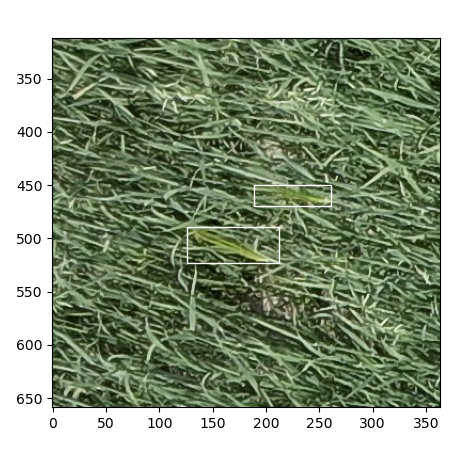

# barleynet



Detect barleys in an oat field!

## Prerequisites

- A computer running Ubuntu or Debian
- A GPU with CUDA support
- Drone images of barleys in a an oat field

## Installation

You'll need Python's venv module. If you don't have it, install it using
```
sudo apt install python3-venv
```

Then, clone this repository and run the setup script.
```
git clone https://github.com/stefanrua/barleynet.git
cd barleynet
./setup.sh
```

## Inference

1. Put your images in the `images/` directory
1. Run `./detect-barleys.sh`
1. The model's predictions are in `predictions.json`

The `predictions.json` file is structured like this:
```
{
  "DJI_20210709135005_0049.JPG": [
    {
      "bbox": [
        125.98060607910156,
        489.400634765625,
        86.45993041992188,
        33.67889404296875
      ],
      "score": 0.9742675423622131
    },
    {
      "bbox": [
        188.53591918945312,
        450.1046142578125,
        72.26141357421875,
        19.381805419921875
      ],
      "score": 0.9708744883537292
    },
  ]
}
```

## Visualization

To visualize the predictions for an image:
```
python3 draw.py DJI_20210709135005_0049.JPG
```
