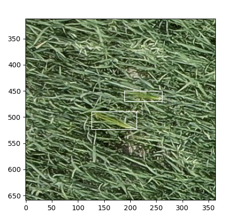

# Detect barleys in an oat field



## How to use

1. Change the image dir path in cut.py and draw.py to your own path
2. Put your model weights in /models
3. Run `./detect-barleys.sh`
4. The model's predictions are in `predictions.json`

The `predictions.json` file is structured like this:
```
{
  "DJI_20210709135005_0049.JPG": [
    {
      "bbox": [
        125.98060607910156,
        489.400634765625,
        86.45993041992188,
        33.67889404296875
      ],
      "score": 0.9742675423622131
    },
    {
      "bbox": [
        188.53591918945312,
        450.1046142578125,
        72.26141357421875,
        19.381805419921875
      ],
      "score": 0.9708744883537292
    },
  ]
}
```

## Visualization

To visualize the predictions for an image:
```
python3 draw.py <image_filename>
```